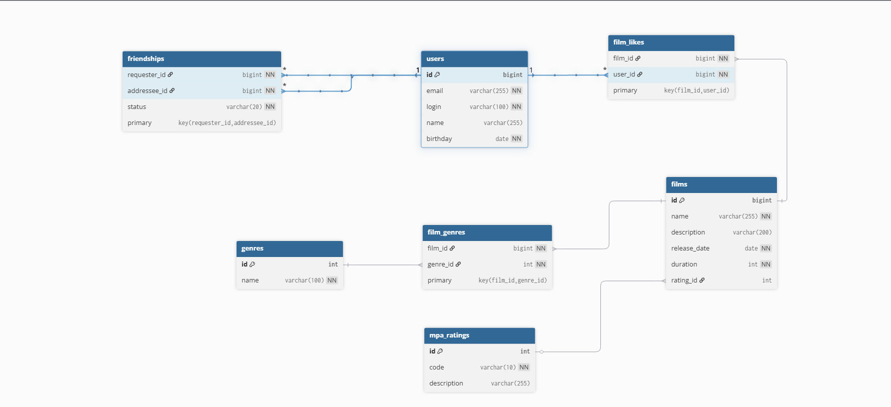

# Filmorate

Filmorate — сервис для оценки и рекомендации фильмов.  

## Логическая схема базы данных



На схеме показаны таблицы, их атрибуты и связи.

## Примеры запросов

### 1. Получить все фильмы
```SQL
SELECT * FROM films;
```
###  2. Топ-10 фильмов по количеству лайков
```SQL
SELECT f.*, COUNT(fl.user_id) AS likes_count
FROM films f
LEFT JOIN film_likes fl ON f.id = fl.film_id
GROUP BY f.id
ORDER BY likes_count DESC
LIMIT 10;
```
###  3. Получить все фильмы определённого жанра
```SQL
SELECT f.*
FROM films f
JOIN film_genres fg ON f.id = fg.film_id
JOIN genres g ON g.id = fg.genre_id
WHERE g.name = 'Комедия';
```